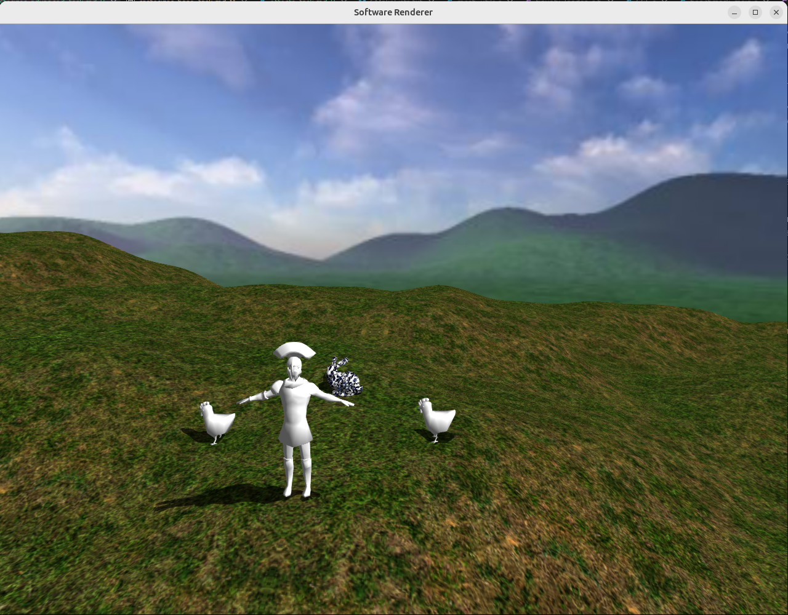

# Задание 5. Графические эффекты

## Цель

Добавить в растеризатор из прошлых заданий два самых базовых эффекта:
тени (с помощью карты теней) и ани-алиасинг (FXAA). Это задание может
быть выполнено без задания 4, в таком случае рендеры сохраняются в
виде изображений на диск. 

## Требования к реализации

* Язык - **C или C++**. Сборка через CMake, проект должен собираться одной
  командой на Linux (gcc/clang).  
* **Использовать OpenGL/Vulkan/DirectX для растеризации запрещено.** Вся
  геометрия и все пиксели считаются вашим кодом на CPU. Графический API
  допустим исключительно как способ показать готовый массив пикселей в окне
  (как в шаблоне).

## Ожидаемый результат

Обе техники (тени и анти-алиасинг) должны быть отключаемыми по горячим клавишам.
Баллы за пункт снимаются частично, если техника работает с дефектами.
Допустимое время рендера повышается относительно задания 4 - до 15 FPS на 640×480
Невыполнение порога 15 FPS на 640×480 в release-сборке снимает до половины баллов
от итоговой суммы;

## Распределение баллов

| Пункт | Содержание | Баллы |
|-------|-----------|-------|
| 1 | Статическая карта теней | 8 |
| 2 | FXAA | 7 |
| | **Итого** | **15** |

## Пункт 1. Статическая карта теней (8 баллов)

Добавьте тени от направленного источника света для статических объектов
сцены.

**Построение карты.** Сцена рисуется второй раз - из позиции источника
света, в отдельный однокональный буфер, содержащий только глубину; цвет
при этом не считается вообще (пиксельный шейдер не вызывается). Для
направленного источника (солнца) правильна **ортографическая** проекция:
лучи солнца параллельны, перспективного схождения быть не должно. Матрицу
ортографической проекции нужно добавить к своей математической библиотеке.
Камера света строится по направлению света и области, которую требуется
покрыть тенями.

Карта строится один раз при запуске (источник и статические объекты не
двигаются) - отсюда «статическая». Сохраните её в PNG: это основной способ
отладки этого пункта.

**Использование.** В пиксельном шейдере основного прохода мировая позиция
фрагмента преобразуется матрицей вида-проекции источника света, приводится
к координатам карты теней, и глубина фрагмента сравнивается с глубиной,
записанной в карте. Если в карте лежит что-то ближе к источнику - фрагмент
в тени, и прямая составляющая освещения обнуляется (фоновая остаётся, иначе
тени будут абсолютно чёрными).

**Bias.** Из-за конечного разрешения карты поверхность затеняет сама себя:
появляется характерная полосатая рябь (shadow acne). Обязательно устраните
её сдвигом сравнения. Учтите, что слишком большой сдвиг отрывает тень от
основания объекта - нужен компромисс, и в идеале сдвиг
зависит от угла между нормалью и направлением на свет.

Подсказки и типичные ошибки:
* Фрагменты, оказавшиеся за пределами области, покрытой картой теней, должны
  считаться освещёнными, а не затенёнными, иначе за границей карты появится
  огромная чёрная область.
* Для фрагментов, отвёрнутых от источника, тень считать бессмысленно - они и
  так не освещены.
* Разрешение карты - параметр. Начните с большого (2048×2048) и посмотрите,
  как деградирует качество края при уменьшении.
* Проверяйте себя по сохранённой в PNG карте: если на ней не видны силуэты
  объектов, проблема в камере света, а не в шейдере использующем карту теней.
* Тени лучше всего видны на ландшафте. Если вы не делали этот пункт - добавьте
  на сцену большой плоский квадрат пола. Ландшафт может не отбрасывать тень сам.

## Пункт 2. FXAA (7 баллов)

Добавьте постобработку - быстрое приближённое сглаживание краёв (FXAA),
работающее уже по готовому кадровому буферу, без дополнительных выборок
геометрии.

**Базовая версия.** Ожидается перенос на CPU алгоритма FXAA 3/3.11
от NVIDIA - эталонную реализацию на hlsl для DX9 можно найти в интернете.

**Оптимизированная версия.** Прямой перенос шейдера медленный: он повсюду
делает билинейные выборки из RGB-буфера и заново считает яркость. Для 
GPU с аппаратными модулями текстурной выборки это не важно, но в софтверном
рендере в 1 поток каждая инструкция на счету. Ускорьте его. 
Ожидаемое направление: предварительно посчитать яркость всех пикселей
кадра в отдельный однокональный буфер за один проход, а в самом фильтре
заменить выборки в целочисленных смещениях на прямое чтение из этого буфера
(билинейная выборка остаётся только там, где позиция действительно дробная). 
Другие оптимизации приветствуются.

Подсказки и типичные ошибки:
* Пиксели по краю кадра требуют отдельной обработки: у них нет полной
  окрестности. Простейший корректный вариант - копировать их без изменений.
* Результат нельзя писать в тот же буфер, из которого читаете: нужен второй
  буфер, иначе уже обработанные пиксели повлияют на соседей.
* Алгоритм работает с яркостью, а не с цветом; определитесь, в каком
  пространстве (линейном или с гаммой) вы её считаете, и не меняйте по ходу
  дела - от этого заметно зависит результат.
* FXAA сглаживает границы, но и слегка размывает текстуры и мелкие детали.
  Это ожидаемое свойство метода, а не ошибка реализации.

Простое копирование эталонной версии дает **3 балла**, реализация с предложенной
оптимизацией **6**.