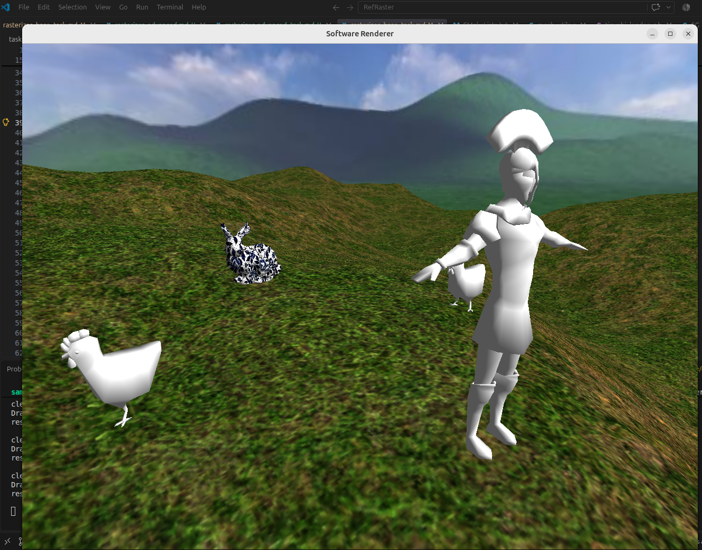

# Задание 4. Продвинутый растеризатор

## Цель

Развить растеризатор из прошлого задания до небольшого движка, рисующего связную
сцену в реальном времени: процедурный ландшафт, несколько моделей на нем,
окружение (скайбокс). Все это с возможностью перемещаться по сцене.

## Требования к реализации

* Язык - **C или C++**. Сборка через CMake, проект должен собираться одной
  командой на Linux (gcc/clang).  
* **Использовать OpenGL/Vulkan/DirectX для растеризации запрещено.** Вся
  геометрия и все пиксели считаются вашим кодом на CPU. Графический API
  допустим исключительно как способ показать готовый массив пикселей в окне
  (как в шаблоне).

## Ожидаемый результат

1. Изображение выводится в окно заданного размера в реальном времени (>20 FPS).
Если частота кадров низкая - уменьшите разрешение. Если при разрешении 640х480 
у вас все еще нет 20 FPS и ваш компьютер выпущен после 2010 года - проблема в реализации,
ищите что замедляет программу.
2. У пользователя должна быть возможность свободно перемещать и вращать камеру.
3. Сделайте несколько режимов визуализации (глубина/однотонный цвет/текстура) и переключение
между ними по нажатию горячих клавиш.
4. Описание горячих клавиш - в README
5. Сцена: ландшафт, несколько разных моделей на нём (хотя бы одна нарисована через 
механизм инстансинга), скайбокс.  Конкретные модели, текстуры и расположение - 
на ваш выбор; можно брать ресурсы из шаблона, можно свои. Требование одно: на
сцене должна быть отчётливо видна каждая из реализованных техник.

Баллы за пункт снимаются частично, если техника работает с дефектами
(видимая граница переключения mip-уровней, дрожание ландшафта при движении,
швы скайбокса, проблемы движения камеры и т.д.).
Невыполнение порога 20 FPS на 640×480 в release-сборке снимает до половины баллов
от итоговой суммы;

## Распределение баллов

| Пункт | Содержание | Баллы |
|-------|-----------|-------|
| 1 | Окно, реальное время, управление камерой | 3 |
| 2 | Рендер в пониженном разрешении и апскейл | 2 |
| 3 | Пирамида mip-уровней, выбор по глубине, трилинейная фильтрация | 2 |
| 4 | Cubemap (скайбокс) | 3 |
| 5 | Процедурный ландшафт: карта высот, движущаяся сетка, нормали, текстуры | 5 |
| | **Итого** | **15** |

| Бонус | Содержание | Баллы |
|-------|-----------|-------|
| Б1 | Выбор mip-уровня по производным текстурных координат | 3 |
| Б2 | Скайбокс без геометрии, выборкой по направлению луча | 2 |

### Пункт 1. Вывод в окно и управление камерой (3 балла)

Перенесите рендер в цикл реального времени: каждый кадр очищается кадровый
буфер и буфер глубины, рисуется сцена, результат переводится в 8-битный RGBA
и выводится в окно средствами шаблона.

Управление камерой: WASD - перемещение относительно текущей ориентации
(вперёд/назад вдоль направления взгляда, влево/вправо вдоль поперечного
вектора), мышь - вращение. Ожидаемая схема: два угла (yaw, pitch)
накапливаются по смещению курсора между кадрами, из них строится матрица
поворота, из неё берутся направление взгляда и вектор «вверх», и уже они
подаются в матрицу вида. Скорость перемещения должна умножаться на длительность 
кадра, иначе камера будет летать с разной скоростью на разных машинах и в разных
режимах сборки. Выводите в консоль или в заголовок окна время кадра.

Подсказки и типичные ошибки:
* На этом этапе наверняка вылезет отсутствие полноценного отсечения по
  ближней плоскости: стоит подойти камерой вплотную к модели, как появляются
  огромные искажённые треугольники. Реализуйте разрезание треугольника
  ближней плоскостью (треугольник, пересекающий плоскость, распадается на
  один или два новых) - атрибуты в новых вершинах получаются линейной
  интерполяцией вдоль рёбер.
* Не пересоздавайте буферы и не перезагружайте текстуры каждый кадр.
* Первое движение мыши после захвата курсора даёт огромный скачок
  ориентации - обработайте первый кадр отдельно.
* Собирайте в релизной конфигурации с оптимизациями (-O2 или -O3): в 
  отладочной сборке программный растеризатор медленнее в разы, и это нормально.

### Пункт 2. Naive upscaling (2 балла)

Разделите разрешение рендера и разрешение окна: сцена рисуется в кадровый
буфер меньшего размера, а на экран выводится растянутой до размера окна.
Размеры окна и внутреннего буфера задаются параметрами командной строки
независимо друг от друга.

Ожидаемый алгоритм апскейла: для каждого пикселя окна вычислить
соответствующую позицию в маленьком буфере и взять оттуда цвет. Реализуйте
хотя бы простейший вариант (ближайший сосед) и билинейный - фильтрация
уже написана в пункте 5, её можно переиспользовать для кадрового буфера.
Целочисленное кратное увеличение (например, ровно в 2 раза) можно выделить
в отдельную быструю ветку без общих вычислений координат.

## Пункт 3. Mip-уровни (2 балла)

Добавьте мипмаппинг, чтобы удалённые текстурированные поверхности не
покрывались шумом и рябью.

**Построение пирамиды.** Из исходной текстуры строится цепочка уменьшенных
вдвое копий, вплоть до размера 1×1. Каждый следующий уровень получается
усреднением блоков 2×2 предыдущего. Учтите нечётные размеры: при делении
пополам последний столбец/строка должны быть обработаны без выхода за границу
массива. Пирамида строится один раз при загрузке текстуры, а не в кадре.

**Выбор уровня.** Обязательный вариант - выбор по глубине фрагмента:
глубину из буфера нужно перевести обратно в линейное расстояние до камеры
(значение в буфере распределено нелинейно, для перевода используются ближняя
и дальняя плоскости) и по логарифму этого расстояния получить номер уровня.
Полученное число обрезается диапазоном имеющихся уровней.

**Трилинейная фильтрация.** Номер уровня получается дробным, поэтому
выбираются два соседних уровня, из каждого делается билинейная выборка
(она уже написана в задании 1), и результаты смешиваются по дробной части.
Без этого при движении камеры будет видна резкая граница переключения
уровней.

Подсказки и типичные ошибки:
* Выбор по глубине корректен для поверхностей вроде ландшафта, где масштаб
  текстуры примерно постоянен, но принципиально неточен: он не учитывает
  ни угол наклона поверхности к камере, ни то, насколько плотно текстура
  уложена на геометрию. Опишите это ограничение в отчёте.
* Коэффициент, связывающий расстояние с номером уровня, зависит от того, во
  сколько раз тайлится текстура. Подберите его так, чтобы вблизи
  использовался нулевой уровень, а не размытая копия.
* Отладочный режим «номер mip-уровня в цвет» (каждый уровень - свой оттенок)
  обязателен: без него невозможно понять, что происходит.

*Бонус 1 (3 балла).* Выбор уровня по производным текстурных координат,
как это делает GPU: оценить, насколько меняются текстурные координаты при
переходе к соседнему пикселю по горизонтали и вертикали, и взять уровень по
большей из двух величин. Производные можно получить аналитически из
уравнений интерполяции атрибутов треугольника либо растеризацией блоками 2×2
пикселя. Такой выбор корректен для любой геометрии, включая наклонные
поверхности и модели с произвольной укладкой текстуры.

## Пункт 4. Cubemap (3 балла)

Добавьте окружение - небо/дальний фон, окружающий сцену со всех сторон.

Ожидаемая реализация: куб из шести граней, каждой грани соответствует своя
текстура. Куб центрируется на камере и перемещается вместе с ней, поэтому
приблизиться к нему невозможно и он всегда остаётся фоном. Номер грани
внутри пиксельного шейдера определяется по номеру треугольника (два
треугольника на грань), текстурные координаты берутся из вершин.

Скайбокс рисуется без освещения - его текстуры уже содержат готовые цвета.
Порядок рисования: скайбокс имеет смысл рисовать последним, когда буфер
глубины уже заполнен геометрией сцены, - тогда закрашиваются только
незанятые пиксели, и работы будет минимум.

Подсказки и типичные ошибки:
* Шесть текстур неба нужно расставить по граням и правильно сориентировать:
  почти гарантированно с первого раза часть граней окажется перевёрнутой или
  зеркальной. Ориентируйтесь по линии горизонта и стыкам между гранями.
* Порядок обхода вершин граней должен быть таким, чтобы куб был виден
  изнутри, иначе отсечение задних граней уберёт весь скайбокс.
* Текстуры окружения не участвуют в освещении, и переводить их в линейное
  пространство при загрузке не нужно - иначе небо получится заметно темнее
  ожидаемого. Определитесь с этим осознанно и отметьте в отчёте.
* Куб должен быть достаточно большим, чтобы не пересекать геометрию сцены, но
  умещаться в дальнюю плоскость отсечения. 
* Куб должен двигаться за камерой

*Бонус 2 (2 балла).* Реализация скайбокса без геометрии: для каждого
незакрашенного пикселя восстановить направление луча из камеры (через
обратную матрицу вида-проекции) и выбрать грань и координаты по наибольшей по
модулю компоненте направления.

## Пункт 5. Ландшафт (5 баллов)

Самый объёмный пункт задания.

**Карта высот.** Сгенерируйте одноканальное изображение карты высот
процедурно, с помощью шума Перлина или другого случайного процесса. 
Одна октава шума Перлина даёт слишком гладкий и однообразный рельеф, 
поэтому ожидается фрактальное суммирование: несколько октав с удваивающейся 
частотой и убывающей вдвое амплитудой. Генератор должен принимать зерно (seed): 
при одном и том же значении ландшафт воспроизводится, при разных - получается разный. 
Карту высот полезно сохранить в PNG для отладки.

**Меш ландшафта.** Равномерная сетка треугольников фиксированного размера,
построенная один раз при запуске. Дальность прорисовки ограничена размером
этой сетки, ее стоит сделать относительно небольшой. 

**Перемещение за камерой.** Сетка не привязана к мировым координатам: каждый
кадр она сдвигается вслед за камерой, так что камера всегда находится в её
центре. Чтобы ландшафт при этом не «плыл» под ногами, сдвиг должен быть
кратен шагу сетки - то есть округляться до целого числа ячеек. Высоты вершин
берутся из карты высот по **мировым** координатам вершины после сдвига, а не
по её номеру в сетке. Тогда при движении камеры вершины «переползают» на
новые места и подхватывают новые высоты, а рельеф остаётся неподвижным
относительно мира.

Смещение вершин по высоте выполняется в вершинном шейдере: сама сетка в
памяти остаётся плоской и неизменной.

**Нормали ландшафта.** Считать их усреднением по треугольникам, как в задании
1, здесь неудобно - геометрия меняется каждый кадр. Ожидаемый подход:
получить нормаль аналитически из производных высоты по двум горизонтальным
осям, взяв их прямо из карты высот в момент вычисления вершины.

**Текстурирование.** Текстурные координаты ландшафта берутся из мировых
координат и тайлятся (повторяются) с выбранным периодом. Как минимум две
текстуры, смешиваемые по какому-либо признаку рельефа - например, трава на
пологих участках и камень/скалы на крутых склонах; крутизна определяется по
нормали. К ландшафту применяются мип-уровни из пункта 2 - на нём эффект
виден лучше всего.

**Камера на ландшафте.** Добавьте режим камеры, удерживающий её на
фиксированной высоте над поверхностью (высота поверхности берётся из карты высот),
и переключение между ним и свободным полётом.

Подсказки и типичные ошибки:
* Один и тот же код выборки высоты используется и в вершинном шейдере, и для
  камеры. Если они разойдутся, камера будет проваливаться под землю или
  парить над ней.
* Не округлив сдвиг сетки до шага ячейки, вы получите неприятную рябь: рельеф
  будет мелко дрожать при движении камеры.
* Выборка высоты по мировым координатам должна быть согласована с выборкой
  производных: и высота, и наклон читаются из одной и той же интерполяции,
  иначе освещение поедет относительно геометрии.
* Плотность сетки задавайте параметром: слишком плотная сетка на CPU быстро
  съест бюджет кадра, слишком редкая даст угловатый рельеф.
* Границу дальности прорисовки видно как обрыв ландшафта. Скайбокс из пункта
  3 частично её скрывает; полностью решать эту проблему в задании не нужно.
