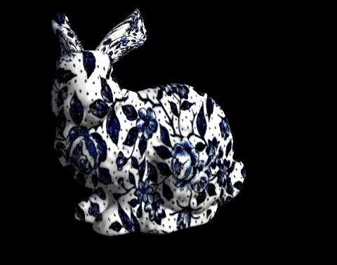
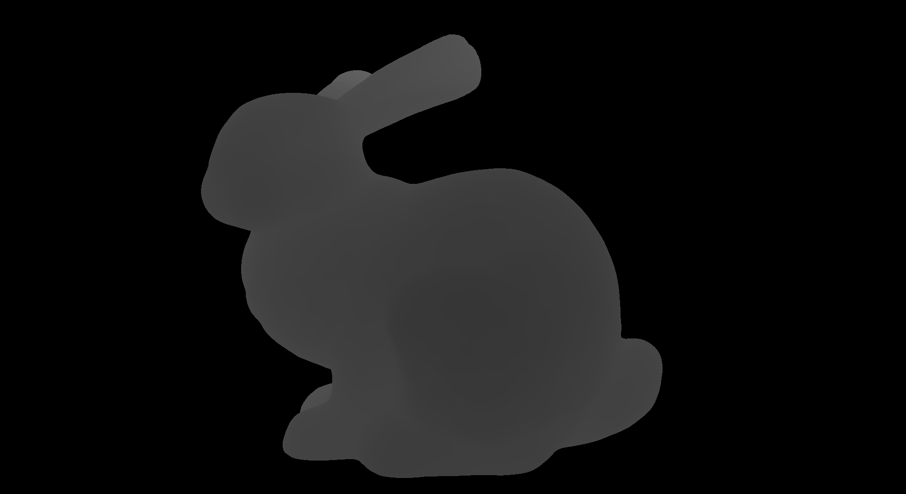
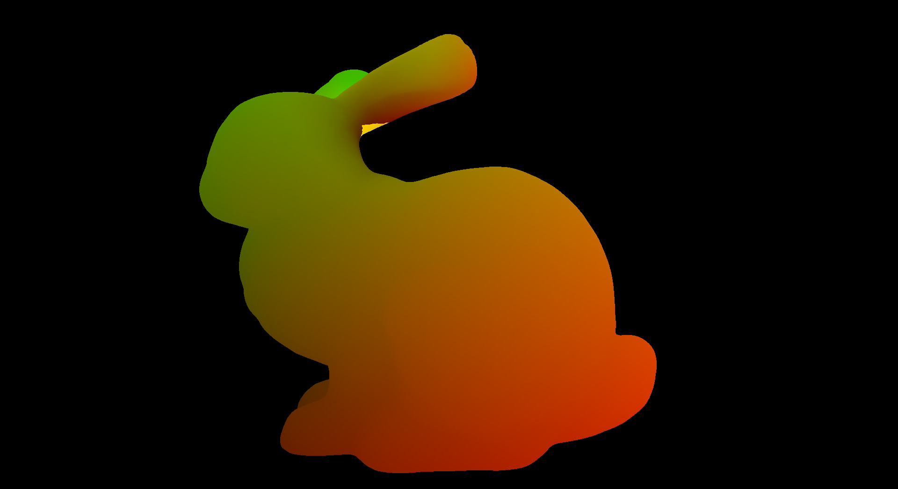

# Задание 3. Базовый растеризатор

## Цель

Написать программный (CPU) растеризатор, который загружает 3D-модель из `.obj`,
проецирует её на экран через матрицы вида и проекции, корректно разрешает
видимость с помощью буфера глубины, освещает модель (Lambert) и накладывает
текстуру. На первом этапе задания изображение сохраняется как `.png` изображение
на диск, на втором вам нужно будет выводить его в реальном времени в окно с управлением
камерой.

Это первое задание курса; на его код будут опираться все последующие задания,
поэтому важна не только картинка, но и вменяемая структура программы.

## Шаблон

Вместе с заданием выдаётся шаблон с реализацией трех нужных для выполнения 
задания функций, а также небольшой набор тестовых моделей и текстур.

1. **Чтение `.obj`** - парсинг модели в структуру меша: массив вершин, массив
   нормалей, массив текстурных координат, массив индексов треугольников.
   Четырёхугольники и n-угольники триангулируются при загрузке.
2. **Чтение и сохранение картинок** - загрузка PNG/JPG в буфер `float`
   и сохранение буфера `float` в PNG.
3. **Создание окна и вывод в него массива пикселей** - окно нужного размера,
   цикл обработки событий, вывод готового массива RGBA8 на экран.

Всё остальное - математика векторов и матриц, сам растеризатор, шейдеры,
работа с буферами - вы пишете сами.

Исходный шаблон проверен и протестирован на Linux, но использует 
кросс-платформенные сторонние библиотеки. Так для создания окна используется 
GLFW https://www.glfw.org. Если вы используете Windows или MAC, установите 
GLFW по инструкции на сайте, для Linux (Debian/Ubuntu) достаточно выполнить

  sudo apt install libglfw3-dev

## Требования к реализации

* Язык - **C или C++**. Сборка через CMake, проект должен собираться одной
  командой на Linux (gcc/clang).  
* **Использовать OpenGL/Vulkan/DirectX для растеризации запрещено.** Вся
  геометрия и все пиксели считаются вашим кодом на CPU. Графический API
  допустим исключительно как способ показать готовый массив пикселей в окне
  (как в шаблоне).

## Ожидаемый результат

Задание состоит из нескольких этапов, за каждый из которых начисляется 
указанное число баллов. Для каждого этапа написан ожидаемый результат 
(как понять, что этап выполнен), но это сделано скорее для вашего 
удобства - при сдаче задания можно показать только общий результат.

Программа рендерит заданную модель в заданном разрешении с текстурой и
моделью освещения Lambert, сохраняет изображение в файл.

## Распределение баллов

| Пункт | Содержание | Баллы |
|-------|-----------|-------|
| 1 | Растеризация 2D-треугольника, барицентрические координаты | 3 |
| 2 | Матричная математика, матрицы вида и проекции | 2 |
| 3 | Буфер глубины, нормализация и вывод 3D-модели | 3 |
| 4 | Нормали (в т.ч. пересчёт) и освещение по Ламберту | 2 |
| 5 | Текстурирование с перспективной коррекцией и фильтрацией | 4 |
| 6 | Несколько моделей, материалы, instancing | 3 |
| | **Итого** | **17** |

Баллы за пункт снимаются частично, если функциональность работает, но с
дефектами (артефакты растеризации, отсутствие перспективной коррекции,
неверные нормали, падение на модели без текстурных координат и т.п.).

### Пункт 1. Растеризация 2D-треугольника (3 балла)

Реализуйте функцию, которая закрашивает в кадровом буфере треугольник,
заданный тремя точками в экранных координатах, и три вершинных цвета,
интерполируемых по площади треугольника.

Ожидаемый подход: посчитать прямоугольник, охватывающий треугольник (bounding
box), обойти в нём все пиксели и для каждого определить, лежит ли он внутри
треугольника. Проверку принадлежности удобно делать через знаковые площади
(они же - векторные произведения) трёх подтреугольников, образованных
пикселем и сторонами исходного треугольника: если все три знака совпадают,
пиксель внутри. Побочный продукт этой же проверки - барицентрические
координаты пикселя, то есть три веса, в сумме дающие единицу; ими и
интерполируются вершинные атрибуты (цвет, а позже - нормаль, текстурные
координаты, глубина).

Подсказки и типичные ошибки:
* Определитесь один раз, где у вас начало координат картинки и куда растёт
  ось Y, и придерживайтесь этого везде. Расхождение между растеризатором
  и функцией сохранения в PNG даёт перевёрнутую картинку - это самый частый
  баг в этом пункте.
* Знак площади треугольника зависит от порядка обхода вершин.
* Вырожденные треугольники (нулевая площадь) обязаны отсекаться до деления
  на площадь, иначе получите NaN и артефакты.
* Не забывайте обрезать bounding box границами кадрового буфера, иначе выход
  за пределы массива.

### Пункт 2. Матрицы вида и проекции (2 балла)

Реализуйте несколько вспомогательных структур и функций: векторы float2/3/4, 
матрицы 3×3 и 4×4, умножение, транспонирование, обращение, а также построение 
матриц модели (перенос, поворот, масштаб), вида (look-at по позиции камеры, 
точке взгляда и вектору «вверх») и перспективной проекции (по углу обзора, 
соотношению сторон, ближней и дальней плоскостям).

Ожидаемый конвейер для каждой вершины: локальные координаты модели →
умножение на матрицу модели → на матрицу вида → на матрицу проекции →
получение однородных координат отсечения → деление на однородную координату
(перспективное деление) → преобразование из нормализованных координат
устройства в пиксельные координаты кадрового буфера. К треугольнику в 
координатах кадрового буфера уже применяется растеризатор из (1)

Подсказки и типичные ошибки:
* Зафиксируйте соглашения и запишите их в README: правая или левая система
  координат, матрицы по строкам или по столбцам, порядок умножения. Половина
  ошибок здесь - от того, что разные части кода используют разные соглашения.
* Проверяйте матрицы по отдельности: обращение матрицы вида должно возвращать
  камеру в исходное положение, произведение матрицы на обратную - единичную.
* Вершины позади камеры после перспективного деления «выворачиваются» на
  экран и рисуют мусор. На этом этапе достаточно отбрасывать треугольники,
  у которых хотя бы одна вершина оказалась за ближней плоскостью; полное
  отсечение по ближней плоскости (с разрезанием треугольника на части) пригодится 
  в части 2, когда камера начнёт въезжать внутрь геометрии.
* Позиции - это точки (однородная координата 1), направления - векторы
  (однородная координата 0). Перенос не должен применяться к направлениям.

### Пункт 3. Буфер глубины и вывод 3D-модели (3 балла)

Загрузите модель из `.obj` и отрисуйте её целиком с корректной видимостью.

Нормализация модели: разные модели приходят в разных единицах и с разным
положением начала координат, поэтому перед отрисовкой модель нужно привести
к единичному кубу. Ожидаемый алгоритм: пройти по всем вершинам, найти
минимальные и максимальные координаты по каждой оси, сдвинуть модель так,
чтобы её Axis-aligned bounding box оказался в центре, и умножить на один общий для всех
трёх осей коэффициент - такой, чтобы наибольший габарит уложился в единицу.
Масштаб обязан быть одинаковым по всем осям, иначе модель растянется.
Нормализацию можно делать изменением вершин или матрицей модели.

Буфер глубины: заведите второй буфер размером с кадровый, в котором для
каждого пикселя хранится глубина уже нарисованного там фрагмента. Перед
кадром он заполняется очень большими значениями. При растеризации глубина
интерполируется по барицентрическим координатам так же, как цвет, и новый
фрагмент рисуется только если он ближе того, что уже лежит в буфере; в этом
случае обновляются и цвет, и глубина.

Визуализация глубины: сделайте режим, в котором цвет пикселя определяется
его глубиной. Линейное отображение глубины в яркость даёт почти одноцветную
картинку, поэтому подберите диапазон (например, по фактическому минимуму и
максимуму в кадре) так, чтобы форма модели была различима.

Дополнительно к глубине реализуйте отсечение задних граней: треугольники,
развёрнутые от камеры, определяются по знаку площади в экранных координатах
и не растеризуются вовсе.

Подсказки и типичные ошибки:
* Значение, которым инициализируется буфер глубины, должно соответствовать
  вашему направлению сравнения.
* Глубина после перспективного деления распределена крайне неравномерно:
  почти вся точность уходит на область у ближней плоскости. Не ставьте
  ближнюю плоскость в очень маленькое значение «на всякий случай» - получите
  z-fighting (мерцающие пятна на плоских участках). 0.01 - разумное значение по умолчанию
* На этом этапе полезно проверять код на модели с большим числом полигонов
  (например, Bunny): ошибки в bounding box и в отсечении задних граней
  на одном треугольнике не видны.

### Пункт 4. Нормали и модель освещения Ламберта (2 балла)

Реализуйте затенение по Ламберту: яркость поверхности пропорциональна
косинусу угла между нормалью и направлением на источник света;
отрицательные значения обрезаются нулём. Источник - направленный (солнце),
задаётся одним вектором направления. К результату добавляется небольшая
постоянная фоновая составляющая, иначе неосвещённые части модели будут
абсолютно чёрными.

Пересчёт нормалей: если в `.obj` нормалей нет (или их число не совпадает с
числом вершин), их нужно посчитать самостоятельно. Ожидаемый алгоритм:
завести на каждую вершину аккумулятор, пройти по всем треугольникам, для
каждого вычислить нормаль грани через векторное произведение двух его рёбер,
прибавить её ко всем трём вершинам треугольника, после обхода нормировать
накопленные суммы. Так получаются усреднённые (сглаженные) вершинные нормали.

Нормали интерполируются по треугольнику барицентрическими координатами и
обязательно нормируются заново уже в пиксельном шейдере: интерполяция
единичных векторов не даёт единичный вектор.

Подсказки и типичные ошибки:
* Нормали преобразуются в мировое/видовое пространство **не** той же
  матрицей, что и позиции: при неравномерном масштабе и других неортогональных
  преобразованиях нужна обратная транспонированная матрица.
* Направление на источник и направление света - противоположные векторы.
  Если модель освещена «не с той стороны» - скорее всего, дело в этом.
* Освещение считается в одном пространстве для всех величин: либо всё в
  мировом, либо всё в видовом. Смешение - источник неочевидных багов, когда
  свет «едет» вслед за камерой.
* Проверяйте на модели без нормалей в файле и на модели с нормалями:
  оба пути должны работать.

### Пункт 5. Текстурные координаты и текстурирование (4 балла)

Возьмите из `.obj` текстурные координаты, интерполируйте их по треугольнику
и используйте для выборки цвета из загруженной текстуры.

**Перспективная коррекция.** Прямая интерполяция текстурных координат
барицентрическими координатами экранного пространства неверна: на вытянутых
в глубину треугольниках текстура «плывёт» и ломается по диагонали
треугольника. Правильный подход: интерполировать в экранном пространстве не
сами атрибуты, а атрибуты, поделённые на однородную координату w, вместе с
величиной 1/w; в пикселе поделить первое на второе. Это касается всех
атрибутов, кроме глубины: интерполированное значение глубины из буфера
глубины линейно в экранном пространстве и корректируется само.

**Фильтрация.** Выборка по ближайшему текселю даёт крупные квадраты на
приближении. Реализуйте билинейную фильтрацию: взять четыре соседних текселя
и смешать их с весами по дробной части текстурных координат. Отдельно
продумайте поведение на границе текстуры (обрезание координат или повтор) -
без этого получите выход за пределы массива на краю.

Подсказки и типичные ошибки:
* В `.obj` вертикальная текстурная координата обычно отсчитывается снизу,
  а картинка в памяти хранится сверху вниз - текстура окажется перевёрнутой.
  Разберитесь и зафиксируйте соглашение.
* Текстуры альбедо хранятся в sRGB. Освещение корректно считать в линейном
  пространстве: переводите текстуру в линейное при загрузке и применяйте
  обратное преобразование (гамму) при сохранении картинки.
* Если модель приходит без текстурных координат - предусмотрите запасной
  вариант (сплошной цвет), программа не должна падать.
* Отладочный режим «текстурные координаты как цвет» экономит много времени:
  видно и разрывы, и отсутствие перспективной коррекции.

## Пункт 6. Несколько моделей и instancing (3 балла)

Необходимо отрисовать более сложную сцену, состоящую из нескольких
экземпляров (instance) нескольких моделей. 

Ожидаемая структура: сцена хранит список объектов, каждый объект - это меш,
его текстура (при наличии) и набор матриц преобразования (по одной на instance).
Функция рисования принимает меш и массив матриц и рисует все копии за один
вызов; вершинный шейдер получает не только номер вершины, но и номер копии
(instance id), чтобы взять свою матрицу. Обычная отрисовка одиночного объекта
становится частным случаем - массив из одной матрицы.

Число копий не оценивается: достаточно показать, что механизм работает.
Но код должен быть устроен так, чтобы добавление копий не означало
дублирования меша в памяти - в этом весь смысл инстансинга.

Отдельно продумайте вопрос ресурсов: у разных объектов разные текстуры, и
пиксельному шейдеру нужно понимать, какой объект он сейчас закрашивает.
Решение (индекс активного объекта в контексте сцены, отдельный шейдер на
объект, материал в структуре объекта) выберите сами и расскажите при сдаче.

Подсказки и типичные ошибки:
* Временные буферы (например, массив обработанных вершин) выделяйте один раз
  и переиспользуйте между кадрами, увеличивая по мере необходимости. У вас не
  должно быть динамического выделения памяти в основном цикле!
* Матрицы, зависящие только от камеры (вид, проекция), считаются один раз за
  кадр, а не на каждый объект и тем более не на каждую вершину.
* Не забудьте про матрицу для нормалей: она своя для каждой копии.
